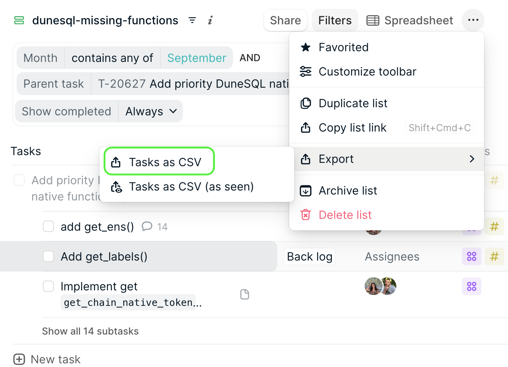
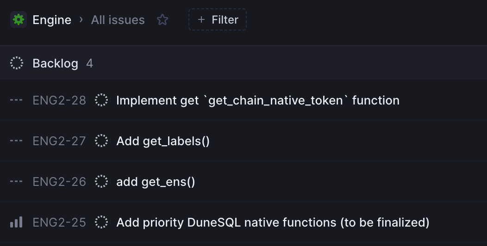

# Migrating from Height to Linear
Linear Importer does not natively support importing. 

This PR is a quick hack to speed up the migration.

## Known limitations
## Parent tasks
With this importer, it is not possible to keep the hierarchy of Parent tasks and subtasks.
As a workaround, a comment with the parent task (if any) will be included in the issue description, so that it is possible to manually recreate the hierarchy.

## Assignees
With this importer, it is not possible to keep the original assignees.
As a workaround, a comment with the original assignees will be included in the issue description, so that it is possible to manually reassign them. Bear in mind that Linear only accepts one assignee per issue.

## Issue status
Status were shared across teams in Height. However, on Linear, different teams can have different statuses. 
The mapping included in this importer is the following:
- "Back log" in Height maps to "Backlog" in Linear
- "On Deck" in Height maps to "On Deck" in Linear
- "On hold" in Height maps to "On Hold" in Linear
- "In progress" in Height maps to "In Progress" in Linear
- "QA" in Height maps to "In Review" in Linear
- "Won't do" in Height maps to "Canceled" in Linear
- "Done" in Height maps to "Done" in Linear

If you need to map them to a different value on Linear, you will need to update the `mapStatus` constant on [HeighCsvImporter.ts](/packages/import/src/importers/heightCsv/HeightCsvImporter.ts) and rebuild the importer (see [Usage](#usage).

## Conversation history
The conversation history of each Height task won't be exported. As a workaround, a link to the original Height task will be included in the issue description, so that it is possible to manually check the conversation history.

## Missing properties
Many properties that are available in Height are not available in Linear. We will need to look for workarounds for these. 
You can find the list of missing properties on [HeightCsvImporter.ts](/packages/import/src/importers/heightCsv/HeightCsvImporter.ts).

## Usage
### Export a lists of tasks from Height
On Height you can export lists with all of their properties `(Export > Tasks as CSV )`.

### Import the CSV file to Linear
On Linear, you need to be a workspace admin to be able to use the CLI Importer. 
You will need to generate a [Linear API Key](https://linear.app/dune/settings/api).

Then, you will need to clone the [Linear CLI Importer forked repo](https://github.com/belen-pruvost/linear).

If you need to tune the logic (for example, to include more Linear Issue statuses), you can do so on the [HeightCsvImporter](/packages/import/src/importers/heightCsv/HeightCsvImporter.ts). Then, you'll need to run `yarn add @linear/sdk` in the packages/import directory. Finally, you can build the project with `yarn build` on the root folder.

The generated .js file will be on the `packages/import/bin` folder. You will need to move the exported CSV file from Height into this directory.

Then, from this same directory, you can run the importer with `./linear-import.js`.

You will be prompted to enter your Linear API Key, the name of the CSV file and a few other properties:

Once the importer finishes its run, you will see the issues being created on Linear.

